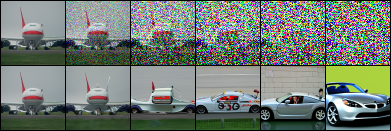
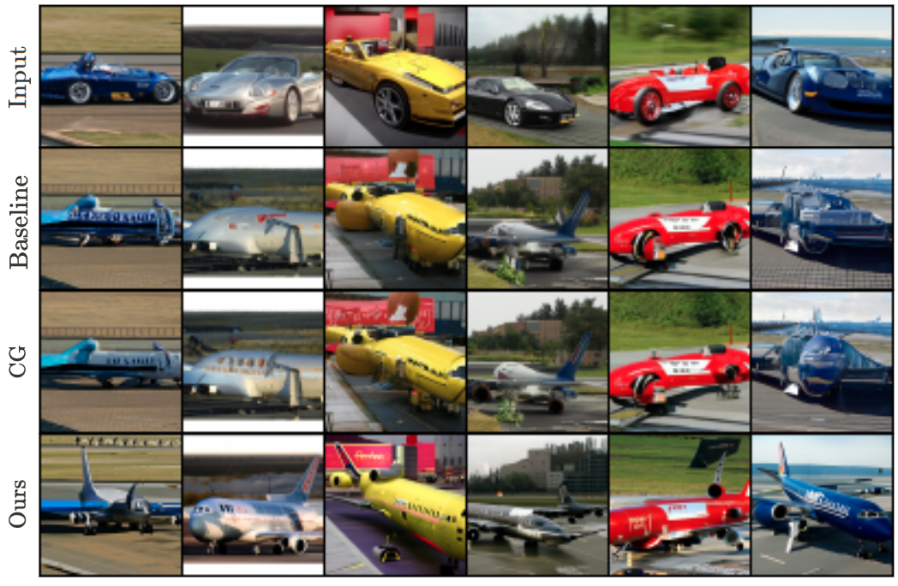
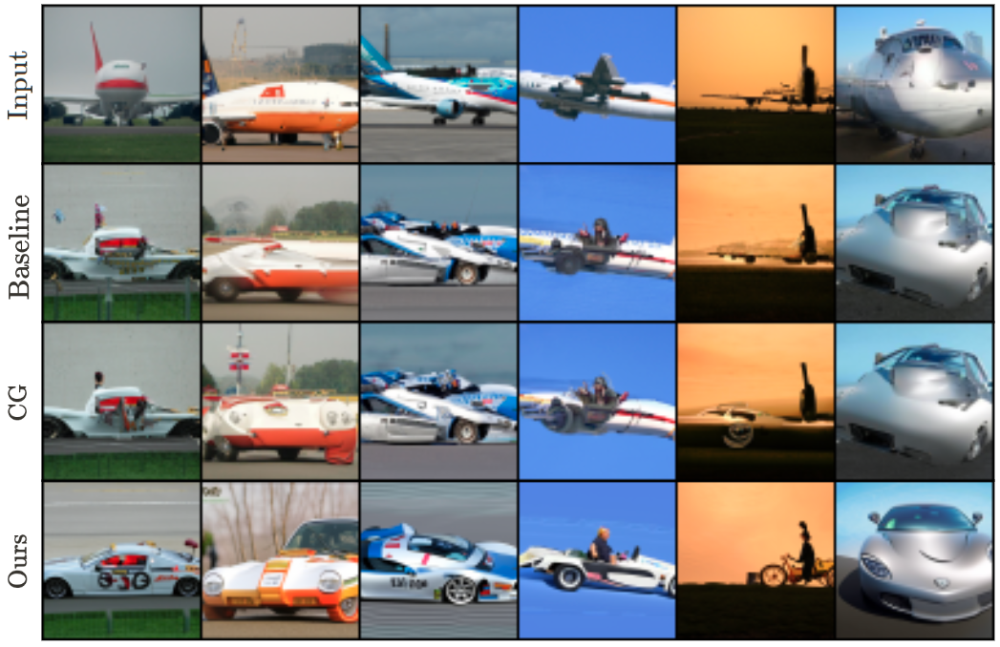

## Source-class Aware CFG

from https://github.com/openai/guided-diffusion

### CFG / Ours

　

### Reverse Process in different noise scales

### Result

### Evaluation

| Class        | Method              | MSE $(\times 10^{-3})$ | Top-1 Accuracy (\%) | Top-5 Accuracy (\%) |
| ------------ | ------------------- | ---------------------- | ------------------- | ------------------- |
| airplane2car | Baseline            | 8.2                    | 2.9                 | 11.8                |
| airplane2car | Classifier Guidance | 8.9                    | 8.4                 | 26.0                |
| airplane2car | Ours                | 12.5                   | 28.3                | 56.8                |
| car2airplane | Baseline            | 13.5                   | 17.9                | 34.8                |
| car2airplane | Classifier Guidance | 14.1                   | 34.5                | 55.8                |
| car2airplane | Ours                | 18.8                   | 77.4                | 92.2                |
